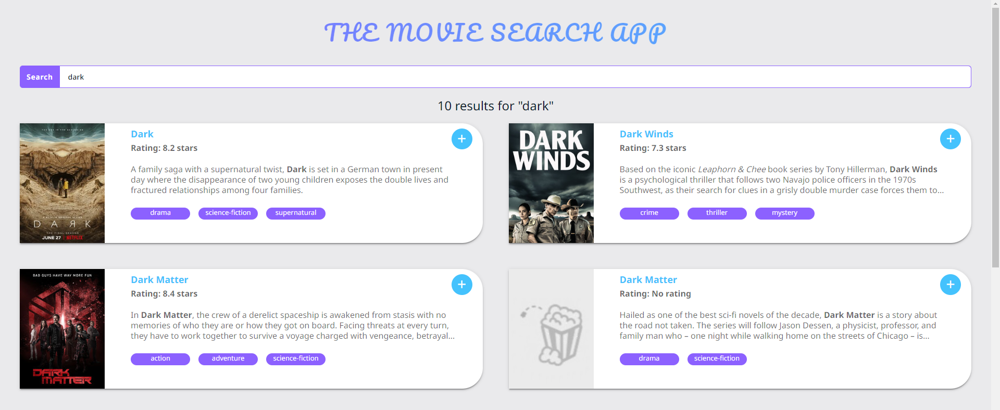
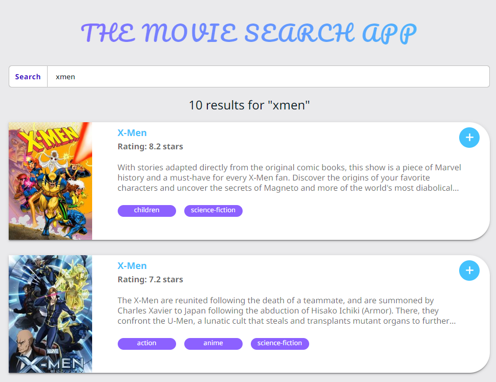
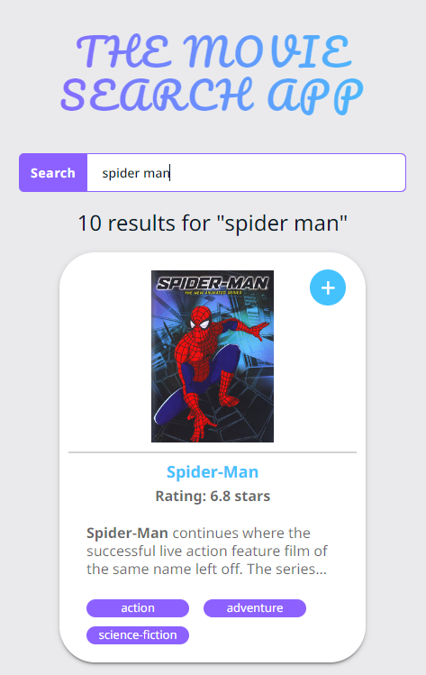
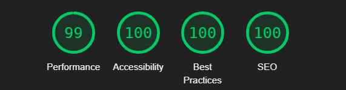

# Movie Search | Technical Test

this project was carried out by Jhon Manuel Angulo Moncada, as a technical test to apply for a vacancy.

## view on Code Sandbox
[Code Sandbox Link](https://codesandbox.io/p/github/JhonAngulo/movie_search_technical_test/main)

## Description
The project is a shows and movies search engine in the TVMAZE api.

When entering text in the search engine, the search is carried out and the matches are displayed, you can view the basic information of the show or movie and it is possible by clicking on the "+" icon to go to TVMAZE to see the complete information of the show or movie.

### Desktop view


### Tablet view


### Mobile view


### Lighthouse report


## Used technologies

1) [Vite](https://vitejs.dev/) 
2) [Typescript](https://www.typescriptlang.org/docs/)
3) [React 18](https://es.reactjs.org/) 
4) [Sass](https://sass-lang.com/)

## commands

  - generate production distribution:

    ```
    npm run build
    ```

  - view local preview:

    ```
    npm run preview
    ```

  - development start:

    ```
    npm run dev
    ```


## API TV MAZE
- https://www.tvmaze.com/api


## documents config

- https://typescript-eslint.io/rules/explicit-function-return-type/
- https://stackoverflow.com/questions/64116378/error-while-loading-rule-typescript-eslint-dot-notation
- https://stackoverflow.com/questions/63118405/how-to-fix-eslintrc-the-file-does-not-match-your-project-config
- https://stackoverflow.com/questions/44717164/unable-to-import-svg-files-in-typescript
